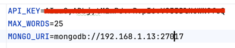

# AstralkaServer
The server is node express REST server running on `http://localhost:3010/` where 3010 default port.

Create .env file in the src folder like that.

Add your GEMINI API Key and path to your mongoDb.

# Running the server
Run `npm run once` to start server. 
Run `npm start` to start dev server with live reload.
